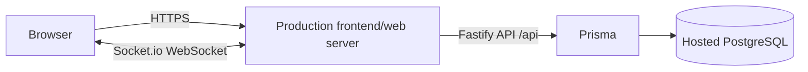

# Deployment Guide: Educational Center ERP

Deploy a single HTTPS web service (frontend + Fastify API + Socket.io) connected to a hosted PostgreSQL database. Production runs on [Railway](https://railway.app): GitHub `main` → Railway → Railway Postgres, with no other host in the path. The production build and start commands live in this repository (`Dockerfile`, `package.json`); environment variables are set in the Railway dashboard, never in a committed file.

> **Operations (backup, restore, rollback, staging simulation, verification checklist) live in [`docs/runbook.md`](runbook.md).** This guide covers configuration; the runbook covers day-to-day operations and recovery.

## 1. Target Architecture



- **Single-service deployment (recommended):** Fastify serves the built SPA (`@fastify/static` from `dist/`) **and** the `/api` REST routes **and** the `/socket.io` WebSocket endpoint on one HTTPS origin. The browser talks to the same origin, so no CORS issues and cookies just work.
- **Split deployment (optional):** the SPA is hosted separately from the API. The client reads `VITE_API_BASE_URL` / `VITE_SOCKET_URL` at build time (baked into the bundle) and credentials are sent cross-origin (cookie requires `credentials: 'include'`; server requires `CORS_ORIGIN` to list the exact frontend origin).

## 2. Environment Variables (production)

| Variable | Required | Meaning |
| :--- | :--- | :--- |
| `NODE_ENV` | yes | Must be `production`. Enables secure cookies, built-in static serving, info-level logging. |
| `DATABASE_URL` | yes | Full PostgreSQL connection string (e.g. Supabase private URL). The app refuses to start without it. |
| `JWT_SECRET` | yes | Long random token-signing secret (e.g. 64+ random bytes hex). Generate once, store in the host's secret settings. |
| `COOKIE_SECRET` | yes | Long random cookie-signing secret. Generate once, store as a secret. |
| `CORS_ORIGIN` | yes | Comma-separated list of allowed browser origins. Set to the public app URL even for same-origin deployments. |
| `JWT_EXPIRES_IN` | no | Session lifetime, e.g. `12h` (default), `8h`, `1d`. Must be >= 1s; the cookie `maxAge` follows it. |
| `PORT` | no | HTTP port the server binds (default `3000`). Hosting providers usually inject this. |
| `DEFAULT_LOCALE` | no | `ar` (default) or `en`. |
| `REQUEST_BODY_LIMIT_KB` / `SOCKET_MAX_PAYLOAD_KB` | no | Request/socket payload caps (default `64` KB). |
| `RATE_LIMIT_*` | no | Per-endpoint rate limits (login/checkin/search/financial). In-memory per process. |
| `SEED_ADMIN_PASSWORD` / `SEED_RECEPTIONIST_PASSWORD` / `SEED_SUPER_ADMIN_PASSWORD` | seed only | Required if you run `npm run db:seed` against production; the seed refuses to run in production without them. |
| `VITE_API_BASE_URL` / `VITE_SOCKET_URL` | build only | Absolute API/WebSocket base URLs for **split hosting**. Set at build time; leave unset for single-service. |

> Rules guaranteed by code:
> - **No production fallback secrets.** `config/index.ts` throws on startup when `DATABASE_URL`, `JWT_SECRET`, `COOKIE_SECRET`, or `CORS_ORIGIN` are missing in `NODE_ENV=production`. Development-only defaults are used solely outside production and print warnings.
> - **No secrets in the repository.** `.env` and `*.local` are git-ignored; only `.env.example` (with placeholders) is tracked. Production secrets are set as Railway service variables.
> - **Cookies** are HTTP-only, signed, `SameSite=Lax`, and `Secure` in production.
> - **Logs** never print secrets: cookie/authorization headers and passwords are redacted; startup logs print port/environment/origins only.

## 3. Build, Migrate & Launch

Requirements: Node.js 20+ and a PostgreSQL 15+ instance (Railway Postgres in production, or `docker-compose.yml` for local).

```powershell
# 1. Install dependencies from the lockfile
npm ci --include=dev        # (first step of the Dockerfile build stage)

# 2. Generate & validate the Prisma client
npm run db:generate         # prisma generate
npx prisma validate

# 3. Build the client and the server
npm run build:production   # prisma generate  +  tsc -b && vite build  +  tsc -p tsconfig.server.json

# 4. Apply migrations against the production database
npm run start:production    # prisma migrate deploy && node dist/server/server/server.js

# 5. Verify
#    GET /api/health  -> 200 {"success":true,"data":{"status":"ok","database":"ok",...}}
```

`npm run start:production` runs `prisma migrate deploy` (the only safe production migration command) and then starts the server. Railway runs exactly this as the service's start command, so migrations are applied on every deploy and before the server accepts traffic.

The server process itself never changes the schema. It probes one table at boot, and if the database answers but the schema does not match `schema.prisma`, **production startup throws and exits non-zero** rather than repairing it — a missing migration stops the deploy instead of being quietly applied, and nothing can drop a column behind the deploy log. Development logs the same condition and keeps serving; it does not push either (use `npm run db:push` or `npm run db:migrate` by hand). The one `db push --accept-data-loss` left in the codebase is the dev-only `/api/setup-demo` reset endpoint, which is registered only when `NODE_ENV=development`. See `AGENTS.md` §3.1.

## 3.1 Production Deployment Path (Railway)

There is exactly one production path: **GitHub `main` → Railway → Railway Postgres**.

1. **Push to `main`.** `.github/workflows/ci.yml` runs the full gate (Prisma validate, migrations on a throwaway PostgreSQL 18, production build, backend + frontend tests, Docker image build). It does not deploy.
2. **Railway builds.** The `er` service builds the root `Dockerfile` — confirmed in the deploy's build log (`load build definition from Dockerfile`, the `build`/`runtime` stages, `node:20-bookworm-slim`). Build stage runs `npm run build:production` (`prisma generate` + `tsc -b && vite build` + `tsc -p tsconfig.server.json`); runtime stage installs production deps plus the Prisma CLI and copies `dist/`. The image is the same one CI builds and `docker-compose.staging.yml` runs locally. Note that the service's builder setting in the Railway dashboard reads `RAILPACK`: that is the configured preference, not what the build resolves to, so trust the build log over the dashboard field.
3. **Railway starts.** The service's start command is `npm run start:production` = `prisma migrate deploy && node dist/server/server/server.js`. Migrations therefore run on the Railway Postgres instance at container start, then Fastify serves `/api`, `/socket.io`, and the built SPA from one origin.
4. **Railway Postgres.** `DATABASE_URL` is a Railway reference variable pointing at the `Postgres` service's private network address. A second service, `er-backup`, runs `Dockerfile.backup` on a daily cron and writes to the `erp-backups` object-storage bucket (see `AGENTS.md` and `docs/runbook.md`).
5. **Health.** `GET /api/health` runs a `SELECT 1` against the database; the container `HEALTHCHECK` and Railway's deploy gate both use it.

Nothing about a deploy lives outside this repository plus the Railway dashboard: no Render blueprint, no provider API call from CI. To re-deploy, use Railway's dashboard or `railway up`.

## 4. Health & Shutdown

- **Health:** `GET /api/health` (public) performs `SELECT 1` against PostgreSQL. Returns `200 ok` or `503 DATABASE_UNAVAILABLE`, and includes `system`, `environment`, `defaultLocale`, `timestamp` — no secrets.
- **Graceful shutdown:** on `SIGTERM`/`SIGINT` the server closes Socket.io, drains Fastify connections, disconnects Prisma, and exits. A 10-second force-exit timer prevents hung deploys.

## 5. First-Seed an Empty Production Database

```powershell
$env:SEED_ADMIN_PASSWORD = "<long-random>"
$env:SEED_RECEPTIONIST_PASSWORD = "<long-random>"
npm run db:seed
```

The seed creates `admin`, `reception1`, `superadmin` (platform administrator), and per-tenant managers with the supplied passwords (dev demo defaults are rejected in production). Change them after first login if they were ever exposed.

## 6. Production Verification Checklist

- [ ] `NODE_ENV=production` and the four required variables are set as Railway service variables (not in a committed file). *(Verified locally: startup fails fast with exit 1 and "…required in production." when they are missing.)*
- [x] `npm ci --include=dev` succeeds from a clean checkout (lockfile in the repo).
- [x] `npm run build:production` succeeds and produces `dist/` (client + backend and frontend suites green after the clean install).
- [ ] `prisma migrate deploy` applies every migration in `prisma/migrations` to Railway Postgres.
- [ ] `/api/health` returns `200` and `database: "ok"`.
- [ ] Login over HTTPS sets a `Secure`, HTTP-only cookie.
- [ ] Check-in from two desks keeps lobby counts in sync (Socket.io upgrade works through Railway's proxy). *(WebSocket transport upgrade verified locally against the production build; unauth clients are rejected with `unauthorized`.)*
- [ ] A browser opened at the public URL loads the SPA with no CORS/WebSocket errors.
- [ ] The laptop that built the app is irrelevant — the service runs on Railway.

## 7. Troubleshooting

| Symptom | Likely cause / fix |
| :--- | :--- |
| Startup aborts with "…required in production." | Missing `DATABASE_URL` / `JWT_SECRET` / `COOKIE_SECRET` / `CORS_ORIGIN`. Set them as Railway service variables. |
| WebSocket never connects / socket falls back to polling | The configured `CORS_ORIGIN` does not match the browser origin visiting the app, or the host blocks upgrade requests. Add the exact origin (protocol + host + port) and allow WebSocket upgrades. |
| CORS error on API calls | Frontend origin not in `CORS_ORIGIN`, or `VITE_API_BASE_URL` mismatched with the API host in a split deployment. |
| Cookie not sent/accepted | Host must be HTTPS in production; the cookie is `Secure`. |
| `/api/health` returns 503 | Database unreachable — check `DATABASE_URL`, that the `er` service is on the same Railway project as `Postgres`, and that the private-network reference variable resolves. |
| Migrations fail on start | `prisma migrate deploy` errored before the server started. Read the deploy log, fix the migration, and re-deploy. `db push` must never be used here — see `AGENTS.md`. |
| Service exits with "Refusing to start in production: the database schema is missing or behind schema.prisma" | The database is reachable but the schema is not what the build expects, so the server stops rather than changing it. Check `npx prisma migrate status` against `DATABASE_URL`, confirm the deployment actually contains the migrations for this commit (a stale build or a start command that skipped `migrate deploy` are the usual causes), then re-deploy. Never "fix" it with `db push`. |
| Session ends too early / too late | Adjust `JWT_EXPIRES_IN`; log out and log in again after a change. |